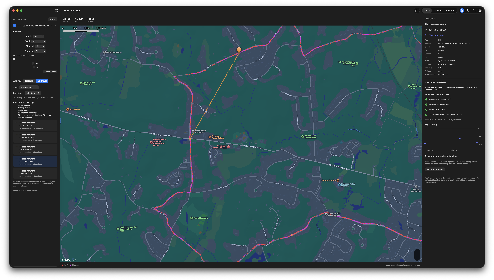

# Wardrive Atlas

Wardrive Atlas is a native SwiftUI + MapKit application for exploring Biscuit/WiGLE Wi-Fi and Bluetooth survey captures privately on an Apple silicon Mac. Capture files are processed on the Mac and are never uploaded.



## Requirements

- macOS 26 or later on Apple silicon.
- Xcode 26.6 or later with the Swift 6.3 toolchain.
- XcodeGen and Java 17 or later for command-line development.

The installed application requires only macOS. Node.js, a development server, Java, and Gradle are not runtime dependencies.

## Build and run

The project follows the same XcodeGen, Swift Package Manager, and Gradle structure as pidex. Open `WardriveAtlas.xcodeproj` and run the **WardriveAtlas** scheme, or use the checked-in Gradle wrapper:

```sh
./gradlew buildApp
./gradlew runApp
./gradlew test
./gradlew testApp
./gradlew testUI
./gradlew check
./gradlew dmg
```

`build` aliases the native build workflow, `run` aliases `runApp`, and `packageDmg` aliases `dmg`. `buildApp` produces `build/app/WardriveAtlas.app`; `dmg` packages that verified bundle under `dist/`, alongside a SHA-256 checksum and release manifest. `clean` removes generated build and distribution artifacts.

Gradle regenerates the Xcode project when configuration or source layout changes and retains Xcode's DerivedData under `build/xcode/`. Unchanged builds skip compilation. Use `-PxcodeJobs=8` to adjust compilation parallelism or `-PwardriveAtlasVersion=0.2.0` to override the version in `project.yml`. Gradle 9.7.1 is pinned with its distribution checksum.

`Package.swift` defines the Swift core library, executable, and core tests. `project.yml` also defines hosted app unit tests and UI tests in the shared scheme. `test` runs the SwiftPM core tests, `testApp` runs the hosted app tests, and `check` runs both. `testUI` remains a separate interactive desktop check. Swift 6.3 tooling uses Swift 5 language mode, matching pidex. Only Apple frameworks are used; no external packages are resolved.

The application icon's master artwork, standalone Mac icon, generation prompt, and resizing instructions are in [Artwork](Artwork/README.md). All required icon sizes are checked in; ordinary builds need no image-generation tools.

## Explore a drive

Use **Import CSV** (⌘O), drag one or more CSV files into the window, or choose **Load Sample Drive** to explore synthetic observations. The importer accepts an optional metadata line, quoted commas, escaped quotes, multiline fields, and the common WiGLE columns:

```text
MAC,SSID,AuthMode,FirstSeen,Channel,RSSI,CurrentLatitude,CurrentLongitude,AltitudeMeters,AccuracyMeters,MfgrId,Type
```

Invalid coordinate rows are skipped. Missing optional manufacturer, time, or signal evidence remains unavailable. Manufacturer IDs are hexadecimal and normalized without guessed byte swapping. Explicit timestamp offsets are honored; timezone-free capture times use the Mac's local timezone. Duplicate filenames receive distinct session names.

Filter by capture, radio, band, channel, security, signal strength, and time. Points, native clusters, and an RSSI-weighted heatmap show the filtered view. Select a map point or sidebar result to inspect its evidence. Enable **Route** for the receiver observation route; **Fit** (⌘0) frames the observations. Apple Maps uses its own styling and cluster boundaries. Dense views group nearby observations before creating native annotations; zooming reveals individual points while analysis retains every row.

**Notable** lists candidate observed addresses with Flock, Axon, or Meta-glasses evidence. Counts describe observed addresses, not confirmed physical devices. Research leads are off by default. Custom and ignored prefix rules are managed in **Settings → Rules**, with compatible version-1 JSON import/export, a 128 KB file limit, and at most 500 custom and 500 ignored rules. Invalid imports leave the current rules unchanged. Dismissals last only for the loaded session and can be restored.

The bundled catalog is version `2026-08-30.1`, reviewed August 30, 2026. Its original explanations and source attribution are included with every match. It does not download updates. Source links open in the browser only when selected. Names, company IDs, and vendor prefixes are evidence, not confirmation of equipment, ownership, or installation location. The CSV cannot recover missing advertisements, service UUIDs, live scanning state, or rotating identities.

## Seen along your drive

The **Co-travel** panel separates Candidates, Observed, Context, and Trusted addresses. Medium sensitivity is the default.

| Sensitivity | Independent sightings | Locations | Elapsed | Travel span |
|---|---:|---:|---:|---:|
| High | 2 | 2 | 5 minutes | 250 m |
| Medium | 3 | 2 | 10 minutes | 500 m |
| Low | 4 | 2 | 20 minutes | 750 m |

Movement evidence groups only the normalized full address and radio. It requires a valid timestamp, a usable nonzero GPS fix, and reported accuracy greater than zero and at most 75 m. At most one observation per clock minute is selected by accuracy, then time and deterministic tie-breakers. Locations use fixed chronological anchors within 200 m; they are not moving centroids or chained clusters.

Every threshold must hold within one rolling 12-hour window. Travel span is the maximum separation of qualifying receiver positions minus both reported accuracy radii, clamped to zero. Wi-Fi and non-research Flock/Axon camera signatures remain context even when moving. Custom camera rules affect context independently of ignored notable prefixes. Meta-name evidence does not suppress movement candidacy. Names, prefixes, and RSSI never link rotating addresses.

The inspector shows whole-range totals separately from the strongest window, a signal-history plot, and independent-sighting timeline. Dashed selected receiver paths break across sessions and gaps greater than five minutes. Mark known equipment as trusted or remove trust to restore its eligibility. Trust never deletes observations or notable evidence.

These are co-travel candidates, not confirmed surveillance or threat probabilities. Shared routes and personal equipment can qualify. Empty results cannot establish that nothing traveled with the recorder.

## Privacy and local settings

**Settings → Privacy** controls shown, hashed, or hidden names and addresses. Map data uses opaque observation/result identifiers and visual properties; raw identifiers are resolved by application state. Hash aliases are pseudonyms, not encryption or guaranteed anonymity.

Imported captures and analysis results remain in memory. **Clear Captures** removes captures, selections, and dismissals. Quitting does not save captures. Only custom rules and trusted identities are saved under:

```text
~/Library/Application Support/com.deepgrant.WardriveAtlas/
  rules-v1.json
  trust-v1.json
```

Trusted identities preserve the version-1 format `{version: 1, devices: [{digest, type}]}`. The digest is the full SHA-256 of `wardrive-atlas:co-travel:v1|<radio>|<normalized address>`. No raw addresses, names, coordinates, timestamps, or capture rows are stored in this file.

One app-wide settings service serializes atomic writes. Failed trust operations remain explicitly session-only; an unrelated successful operation never silently saves them. **Save change** explicitly retries that identity. Failed rule saves offer **Save changes** and **Discard changes** before further editing. Rules and trust show independent warnings in the sidebar and their corresponding Settings tabs; resolving one issue leaves the others visible. Invalid trust files are not overwritten. Resetting custom rules leaves trusted identities intact.

Browser storage is not migrated automatically. Previously exported custom-rule JSON files remain importable. The native trusted list starts empty.

Apple Maps contacts Apple for street-map resources when enabled. Disable **Street map** to use an interactive native coordinate grid. Offline startup does not create a MapKit map view. Previously issued online requests may finish as the map is removed. The app does not download offline street-map regions, and cached Apple Maps tiles are not an offline-map guarantee.

## Verification and distribution

Core tests cover import boundaries, the preserved synthetic reference outputs, detection rules, rolling-window evidence against a brute-force oracle, ranking ties, map-property privacy, concurrent settings changes, independent failure/retry semantics, and cancellation. Hosted app tests cover stale selections, deliberately out-of-order analysis/projection, cached trust filtering, bounded viewport geometry, and heatmap frame placement. App and UI tests use isolated settings directories and offline startup.

Run the release-mode workload benchmark with:

```sh
ATLAS_BENCHMARK=1 swift test -c release --filter BenchmarkTests
```

Use `ATLAS_UI_BENCHMARK=1 ./gradlew testUI` to include the 10,000/100,000-row native map workload. To run one UI test, use `-PuiTest=WardriveAtlasUITests/WardriveAtlasUITests/testCSVImportFromNativePanel`.

Measure release-mode trust filtering with 0, 1,000, and 10,000 saved identities using:

```sh
ATLAS_TRUST_BENCHMARK=1 ./gradlew testApp \
  -PappTestConfiguration=Release \
  -PappTest=WardriveAtlasAppTests/AppCoordinatorTests/testTrustPerformance
```

The large UI workload also exercises Co-travel and a Trusted settings tab populated with 10,000 entries. Benchmarks record timings without machine-dependent pass/fail thresholds.

See [validation results](Documentation/VALIDATION.md) for measured results and limits, and [native architecture](Documentation/ARCHITECTURE.md) for implementation details. Live scanning, saved capture archives, and downloaded offline street maps are outside this version.

Local builds are ad-hoc signed. Developer ID builds use `DEVELOPER_ID_APPLICATION` and `APPLE_TEAM_ID`. To notarize a distribution, configure `NOTARY_KEYCHAIN_PROFILE` (or the same notarization credentials used by pidex) and run:

```sh
NOTARIZE=1 ./gradlew dmg
```

Notarization is opt-in; building or packaging does not publish a release.

## License

Apache-2.0. The bundled research catalog preserves its original source attribution.
